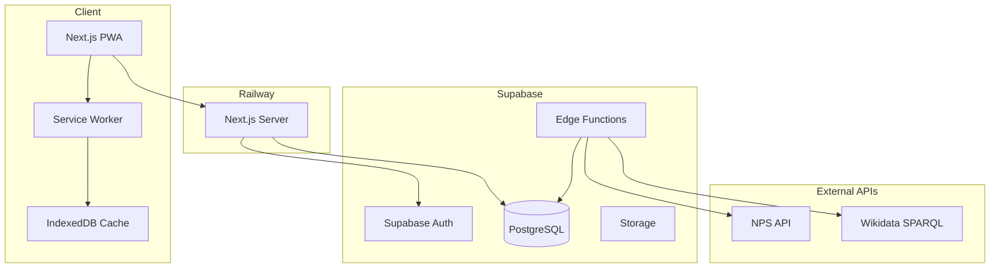
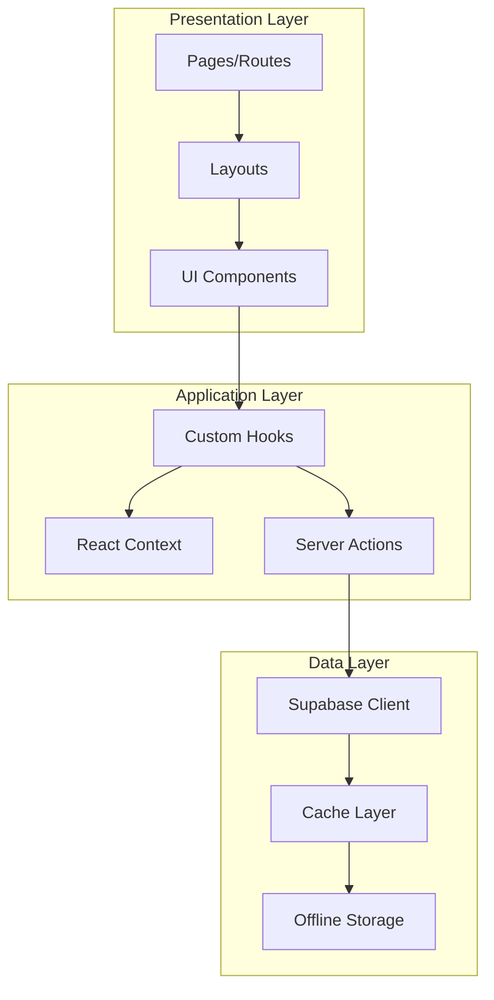
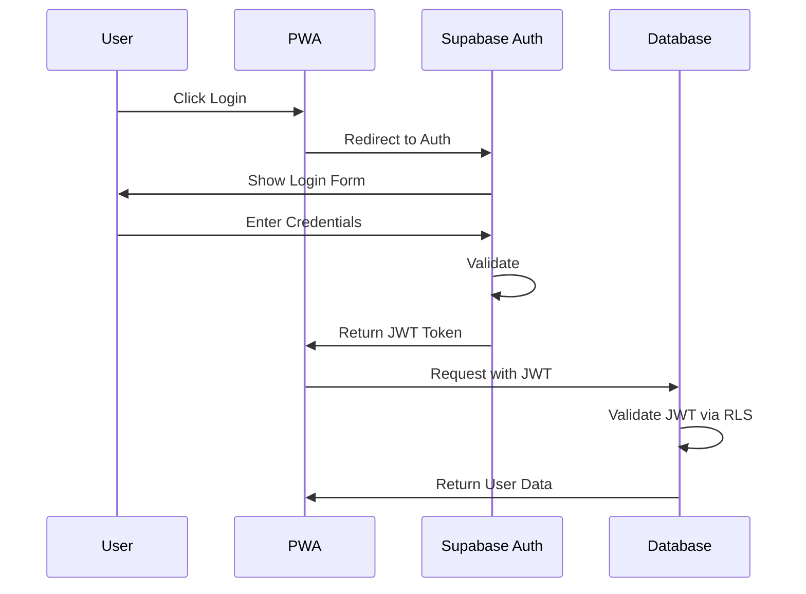

# Architecture Overview

This document describes the system architecture for ParkLookup.com, a Progressive Web App for exploring U.S. National Parks.

## System Overview

## Architecture Principles

### 1. Mobile-First Design
- All UI components designed for mobile viewport first
- Progressive enhancement for larger screens
- Touch-friendly interactions
- Optimized images and lazy loading

### 2. Offline-First PWA
- Service Worker for caching strategies
- IndexedDB for offline data storage
- Background sync for favorites and user data
- App manifest for installability

### 3. Server-Side Rendering
- Next.js App Router with React Server Components
- SEO-optimized pages
- Fast initial page loads
- Streaming for improved perceived performance

### 4. Edge-First Data Processing
- Supabase Edge Functions for data imports
- Scheduled functions for regular updates
- Minimal server-side processing

## Component Architecture

### Frontend Layers

### Key Components

| Component | Purpose |
|-----------|---------|
| `ParkList` | Displays paginated list of parks |
| `ParkCard` | Individual park preview card |
| `ParkDetail` | Full park information view |
| `ParkMap` | Interactive map component |
| `SearchBar` | Search and filter interface |
| `FavoriteButton` | Toggle favorite status |
| `AuthModal` | Login/signup modal |

## Data Flow

### Read Operations

1. User requests park data
2. Check Service Worker cache
3. If cached and fresh, return cached data
4. Otherwise, fetch from Supabase
5. Update cache with new data
6. Return data to user

### Write Operations (Favorites)

1. User toggles favorite
2. Optimistic UI update
3. Queue sync operation
4. If online, sync immediately
5. If offline, store in IndexedDB
6. Background sync when online

## Security Architecture

### Authentication Flow

### Row Level Security (RLS)

- All database tables protected by RLS policies
- Users can only read/write their own favorites
- Public park data readable by all
- Admin functions protected by service role

## Performance Considerations

### Caching Strategy

| Resource Type | Strategy | TTL |
|--------------|----------|-----|
| Static Assets | Cache First | 1 year |
| Park Images | Cache First | 1 week |
| Park Data | Stale While Revalidate | 1 hour |
| User Data | Network First | N/A |

### Optimization Techniques

1. **Image Optimization**
   - Next.js Image component
   - WebP format with fallbacks
   - Responsive srcset
   - Lazy loading

2. **Code Splitting**
   - Route-based splitting
   - Dynamic imports for heavy components
   - Prefetching for likely navigation

3. **Database Optimization**
   - Indexed columns for search
   - Materialized views for complex queries
   - Connection pooling via Supabase

## Scalability

### Horizontal Scaling
- Railway auto-scaling for Next.js
- Supabase managed scaling
- CDN for static assets

### Data Growth
- Pagination for large datasets
- Efficient indexing strategy
- Archive strategy for old data

## Monitoring & Observability

- Railway metrics for server health
- Supabase dashboard for database metrics
- Client-side error tracking
- Performance monitoring with Web Vitals

## Related Documentation

- [Database Schema](./DATABASE.md)
- [API Documentation](./API.md)
- [PWA Implementation](./PWA.md)
- [Deployment Guide](./DEPLOYMENT.md)