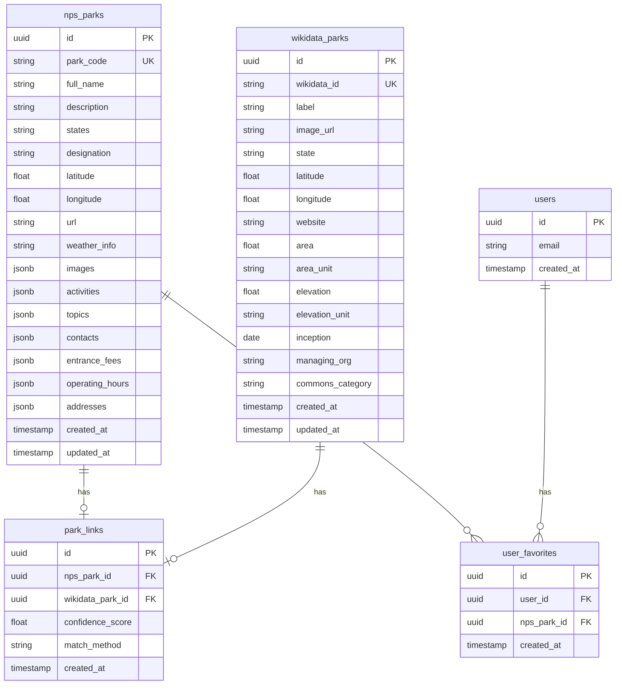

# Database Schema

This document describes the Supabase PostgreSQL database schema for ParkLookup.com.

## Overview

The database consists of four main tables:
- `nps_parks` - National Park Service data
- `wikidata_parks` - Wikidata supplementary data
- `park_links` - Links between NPS and Wikidata records
- `user_favorites` - User favorite parks

## Entity Relationship Diagram



## Table Definitions

### nps_parks

Stores data from the National Park Service API.

```sql
CREATE TABLE nps_parks (
    id UUID PRIMARY KEY DEFAULT gen_random_uuid(),
    park_code VARCHAR(10) UNIQUE NOT NULL,
    full_name VARCHAR(255) NOT NULL,
    description TEXT,
    states VARCHAR(50),
    designation VARCHAR(100),
    latitude DECIMAL(10, 8),
    longitude DECIMAL(11, 8),
    url TEXT,
    weather_info TEXT,
    images JSONB DEFAULT '[]'::jsonb,
    activities JSONB DEFAULT '[]'::jsonb,
    topics JSONB DEFAULT '[]'::jsonb,
    contacts JSONB DEFAULT '{}'::jsonb,
    entrance_fees JSONB DEFAULT '[]'::jsonb,
    operating_hours JSONB DEFAULT '[]'::jsonb,
    addresses JSONB DEFAULT '[]'::jsonb,
    created_at TIMESTAMPTZ DEFAULT NOW(),
    updated_at TIMESTAMPTZ DEFAULT NOW()
);

-- Indexes
CREATE INDEX idx_nps_parks_states ON nps_parks(states);
CREATE INDEX idx_nps_parks_designation ON nps_parks(designation);
CREATE INDEX idx_nps_parks_full_name ON nps_parks USING gin(to_tsvector('english', full_name));
CREATE INDEX idx_nps_parks_location ON nps_parks USING gist(
    ST_SetSRID(ST_MakePoint(longitude, latitude), 4326)
);
```

### wikidata_parks

Stores supplementary data from Wikidata SPARQL queries.

```sql
CREATE TABLE wikidata_parks (
    id UUID PRIMARY KEY DEFAULT gen_random_uuid(),
    wikidata_id VARCHAR(20) UNIQUE NOT NULL,
    label VARCHAR(255) NOT NULL,
    image_url TEXT,
    state VARCHAR(100),
    latitude DECIMAL(10, 8),
    longitude DECIMAL(11, 8),
    website TEXT,
    area DECIMAL(20, 6),
    area_unit VARCHAR(50),
    elevation DECIMAL(10, 2),
    elevation_unit VARCHAR(50),
    inception DATE,
    managing_org VARCHAR(255),
    commons_category VARCHAR(255),
    created_at TIMESTAMPTZ DEFAULT NOW(),
    updated_at TIMESTAMPTZ DEFAULT NOW()
);

-- Indexes
CREATE INDEX idx_wikidata_parks_state ON wikidata_parks(state);
CREATE INDEX idx_wikidata_parks_label ON wikidata_parks USING gin(to_tsvector('english', label));
```

### park_links

Links NPS parks to their Wikidata counterparts.

```sql
CREATE TABLE park_links (
    id UUID PRIMARY KEY DEFAULT gen_random_uuid(),
    nps_park_id UUID REFERENCES nps_parks(id) ON DELETE CASCADE,
    wikidata_park_id UUID REFERENCES wikidata_parks(id) ON DELETE CASCADE,
    confidence_score DECIMAL(3, 2) DEFAULT 0.00,
    match_method VARCHAR(50),
    created_at TIMESTAMPTZ DEFAULT NOW(),
    UNIQUE(nps_park_id, wikidata_park_id)
);

-- Indexes
CREATE INDEX idx_park_links_nps ON park_links(nps_park_id);
CREATE INDEX idx_park_links_wikidata ON park_links(wikidata_park_id);
```

### user_favorites

Stores user favorite parks.

```sql
CREATE TABLE user_favorites (
    id UUID PRIMARY KEY DEFAULT gen_random_uuid(),
    user_id UUID REFERENCES auth.users(id) ON DELETE CASCADE NOT NULL,
    nps_park_id UUID REFERENCES nps_parks(id) ON DELETE CASCADE NOT NULL,
    created_at TIMESTAMPTZ DEFAULT NOW(),
    UNIQUE(user_id, nps_park_id)
);

-- Indexes
CREATE INDEX idx_user_favorites_user ON user_favorites(user_id);
CREATE INDEX idx_user_favorites_park ON user_favorites(nps_park_id);
```

## Row Level Security (RLS)

### nps_parks & wikidata_parks

```sql
-- Enable RLS
ALTER TABLE nps_parks ENABLE ROW LEVEL SECURITY;
ALTER TABLE wikidata_parks ENABLE ROW LEVEL SECURITY;

-- Public read access
CREATE POLICY "Public read access for nps_parks"
    ON nps_parks FOR SELECT
    USING (true);

CREATE POLICY "Public read access for wikidata_parks"
    ON wikidata_parks FOR SELECT
    USING (true);

-- Service role only for writes
CREATE POLICY "Service role write access for nps_parks"
    ON nps_parks FOR ALL
    USING (auth.role() = 'service_role');

CREATE POLICY "Service role write access for wikidata_parks"
    ON wikidata_parks FOR ALL
    USING (auth.role() = 'service_role');
```

### user_favorites

```sql
-- Enable RLS
ALTER TABLE user_favorites ENABLE ROW LEVEL SECURITY;

-- Users can read their own favorites
CREATE POLICY "Users can read own favorites"
    ON user_favorites FOR SELECT
    USING (auth.uid() = user_id);

-- Users can insert their own favorites
CREATE POLICY "Users can insert own favorites"
    ON user_favorites FOR INSERT
    WITH CHECK (auth.uid() = user_id);

-- Users can delete their own favorites
CREATE POLICY "Users can delete own favorites"
    ON user_favorites FOR DELETE
    USING (auth.uid() = user_id);
```

## Views

### parks_with_wikidata

Combined view of NPS parks with linked Wikidata information.

```sql
CREATE VIEW parks_with_wikidata AS
SELECT 
    n.id,
    n.park_code,
    n.full_name,
    n.description,
    n.states,
    n.designation,
    n.latitude,
    n.longitude,
    n.url,
    n.weather_info,
    n.images,
    n.activities,
    n.topics,
    n.contacts,
    n.entrance_fees,
    n.operating_hours,
    n.addresses,
    w.image_url AS wikidata_image,
    w.area,
    w.area_unit,
    w.elevation,
    w.elevation_unit,
    w.inception,
    w.managing_org,
    w.commons_category,
    pl.confidence_score AS link_confidence
FROM nps_parks n
LEFT JOIN park_links pl ON n.id = pl.nps_park_id
LEFT JOIN wikidata_parks w ON pl.wikidata_park_id = w.id;
```

### user_favorites_with_parks

View for user favorites with full park details.

```sql
CREATE VIEW user_favorites_with_parks AS
SELECT 
    uf.id AS favorite_id,
    uf.user_id,
    uf.created_at AS favorited_at,
    p.*
FROM user_favorites uf
JOIN parks_with_wikidata p ON uf.nps_park_id = p.id;
```

## Functions

### search_parks

Full-text search function for parks.

```sql
CREATE OR REPLACE FUNCTION search_parks(search_query TEXT)
RETURNS SETOF parks_with_wikidata AS $$
BEGIN
    RETURN QUERY
    SELECT *
    FROM parks_with_wikidata
    WHERE 
        to_tsvector('english', full_name || ' ' || COALESCE(description, '')) 
        @@ plainto_tsquery('english', search_query)
    ORDER BY 
        ts_rank(
            to_tsvector('english', full_name || ' ' || COALESCE(description, '')),
            plainto_tsquery('english', search_query)
        ) DESC;
END;
$$ LANGUAGE plpgsql;
```

### get_parks_by_state

Filter parks by state abbreviation.

```sql
CREATE OR REPLACE FUNCTION get_parks_by_state(state_code VARCHAR)
RETURNS SETOF parks_with_wikidata AS $$
BEGIN
    RETURN QUERY
    SELECT *
    FROM parks_with_wikidata
    WHERE states ILIKE '%' || state_code || '%'
    ORDER BY full_name;
END;
$$ LANGUAGE plpgsql;
```

### toggle_favorite

Toggle a park as favorite for a user.

```sql
CREATE OR REPLACE FUNCTION toggle_favorite(p_park_id UUID)
RETURNS BOOLEAN AS $$
DECLARE
    existing_favorite UUID;
BEGIN
    SELECT id INTO existing_favorite
    FROM user_favorites
    WHERE user_id = auth.uid() AND nps_park_id = p_park_id;
    
    IF existing_favorite IS NOT NULL THEN
        DELETE FROM user_favorites WHERE id = existing_favorite;
        RETURN FALSE;
    ELSE
        INSERT INTO user_favorites (user_id, nps_park_id)
        VALUES (auth.uid(), p_park_id);
        RETURN TRUE;
    END IF;
END;
$$ LANGUAGE plpgsql SECURITY DEFINER;
```

## Migrations

Migrations are stored in `supabase/migrations/` and applied using the Supabase CLI.

```bash
# Create a new migration
supabase migration new create_parks_tables

# Apply migrations
supabase db push

# Reset database (development only)
supabase db reset
```

## Related Documentation

- [Architecture Overview](./ARCHITECTURE.md)
- [API Documentation](./API.md)
- [Deployment Guide](./DEPLOYMENT.md)