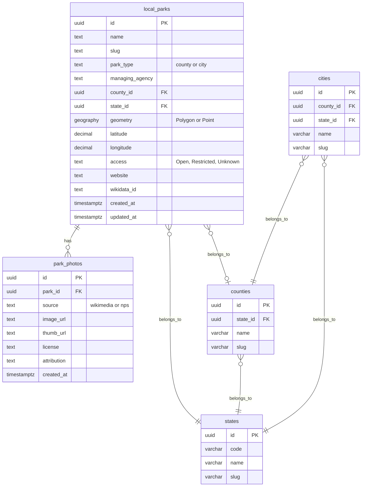

# County & City Parks Expansion - Implementation Plan

## Overview

This plan implements Phase 1 of the County & City Parks expansion for ParkLookup.com, adding support for local parks sourced from USGS PAD-US and photos from Wikidata/Wikimedia Commons.

## Architecture

### Data Flow Diagram

```mermaid
flowchart TD
    subgraph Data Sources
        PADUS[USGS PAD-US ArcGIS REST API]
        PADUS_BULK[PAD-US GeoJSON/Shapefile Bulk Download]
        WIKIDATA[Wikidata SPARQL Endpoint]
        WIKIMEDIA[Wikimedia Commons API]
    end

    subgraph Import Pipeline
        PADUS_CLIENT[lib/api/padus.js]
        WIKIDATA_MATCH[lib/api/wikidata-local.js]
        IMPORT_PARKS[scripts/import-local-parks.js]
        IMPORT_PHOTOS[scripts/import-local-park-photos.js]
    end

    subgraph Supabase Database
        LOCAL_PARKS[(local_parks table)]
        PARK_PHOTOS[(park_photos table)]
        STATES[(states table)]
        COUNTIES[(counties table)]
        CITIES[(cities table)]
    end

    subgraph Next.js API Routes
        API_LIST[/api/local-parks]
        API_DETAIL[/api/local-parks/id]
        API_SEARCH[/api/local-parks/search]
    end

    subgraph Frontend Pages
        COUNTY_LIST[/parks/county/state/county]
        CITY_LIST[/parks/city/state/city]
        COUNTY_DETAIL[/parks/county/state/county/park]
        CITY_DETAIL[/parks/city/state/city/park]
    end

    PADUS --> PADUS_CLIENT
    PADUS_BULK --> PADUS_CLIENT
    PADUS_CLIENT --> IMPORT_PARKS
    IMPORT_PARKS --> LOCAL_PARKS
    LOCAL_PARKS --> WIKIDATA_MATCH
    WIKIDATA --> WIKIDATA_MATCH
    WIKIDATA_MATCH --> IMPORT_PHOTOS
    WIKIMEDIA --> IMPORT_PHOTOS
    IMPORT_PHOTOS --> PARK_PHOTOS

    LOCAL_PARKS --> API_LIST
    LOCAL_PARKS --> API_DETAIL
    LOCAL_PARKS --> API_SEARCH
    PARK_PHOTOS --> API_DETAIL

    API_LIST --> COUNTY_LIST
    API_LIST --> CITY_LIST
    API_DETAIL --> COUNTY_DETAIL
    API_DETAIL --> CITY_DETAIL

    LOCAL_PARKS --> STATES
    LOCAL_PARKS --> COUNTIES
    LOCAL_PARKS --> CITIES
```

### Database Schema



## Implementation Tasks

### Phase 1A: Database & Data Pipeline

1. **Create Supabase migration for local_parks table**
   - File: `supabase/migrations/20240101000029_local_parks.sql`
   - Create `local_parks` table with all fields from PRD
   - Create `park_photos` table for photo storage
   - Add indexes for slug, state_id, county_id, location
   - Add RLS policies for public read access
   - Create view combining all park types

2. **Create PAD-US API client**
   - File: `lib/api/padus.js`
   - Query PAD-US ArcGIS REST Feature Service
   - Filter by ManagerType = County OR Local
   - Filter by Access = Open
   - Handle pagination for large datasets
   - Implement bulk download fallback for GeoJSON

3. **Create Wikidata matching service for local parks**
   - File: `lib/api/wikidata-local.js`
   - Match parks by name + coordinates proximity
   - Fetch P18 image property
   - Fetch P373 Commons category
   - Handle rate limiting

4. **Create import script for PAD-US parks**
   - File: `scripts/import-local-parks.js`
   - Fetch parks from PAD-US
   - Normalize data to local_parks schema
   - Upsert into Supabase
   - Log import progress and errors

5. **Create import script for Wikidata photos**
   - File: `scripts/import-local-park-photos.js`
   - Query local_parks without photos
   - Match with Wikidata
   - Fetch Commons images
   - Store in park_photos table

### Phase 1B: API Routes

6. **Create GET /api/local-parks route**
   - File: `app/api/local-parks/route.js`
   - List parks with pagination
   - Filter by state, county, city, park_type
   - Include photo count

7. **Create GET /api/local-parks/[id] route**
   - File: `app/api/local-parks/[id]/route.js`
   - Return single park with photos
   - Include related county/state info

8. **Create GET /api/local-parks/search route**
   - File: `app/api/local-parks/search/route.js`
   - Full-text search on name
   - Filter by park_type, state, county
   - Return paginated results

### Phase 1C: Frontend Components

9. **Create LocalParkCard component**
   - File: `components/parks/LocalParkCard.jsx`
   - Display park thumbnail, name, type, location
   - Link to detail page
   - Show placeholder if no photo

10. **Create LocalParkDetailClient component**
    - File: `components/parks/LocalParkDetailClient.jsx`
    - Hero image with fallback
    - Park info: name, type, agency, location
    - Map view
    - Photo gallery
    - Weather integration ready

11. **Create placeholder image component**
    - File: `components/ui/ParkPlaceholder.jsx`
    - Generic park silhouette or scenic placeholder
    - Different variants for county vs city

### Phase 1D: Frontend Pages

12. **Create county park detail page**
    - File: `app/parks/county/[state]/[county]/[parkSlug]/page.jsx`
    - Server-side rendering for SEO
    - Schema.org Park structured data
    - Breadcrumb navigation

13. **Create city park detail page**
    - File: `app/parks/city/[state]/[city]/[parkSlug]/page.jsx`
    - Same structure as county page
    - Different URL pattern

14. **Create county listing page**
    - File: `app/parks/county/[state]/[county]/page.jsx`
    - List all parks in county
    - Pagination
    - Map view toggle

15. **Create city listing page**
    - File: `app/parks/city/[state]/[city]/page.jsx`
    - List all parks in city
    - Pagination
    - Map view toggle

16. **Create state-level index pages**
    - File: `app/parks/county/[state]/page.jsx`
    - File: `app/parks/city/[state]/page.jsx`
    - List counties/cities with park counts
    - Link to individual listings

### Phase 1E: Integration & SEO

17. **Update all_parks view**
    - Modify existing view to include local_parks
    - Ensure consistent schema across park types

18. **Add local parks to map visualization**
    - Update InteractiveParksMap component
    - Add layer toggle for local parks
    - Different markers for county vs city

19. **Add Schema.org structured data**
    - Park schema for detail pages
    - BreadcrumbList for navigation
    - Place schema with geo coordinates

20. **Create sitemap generator**
    - File: `scripts/generate-local-parks-sitemap.js`
    - Generate XML sitemap for all local parks
    - Include lastmod dates
    - Split into multiple files if needed

## URL Structure

```
/parks/county/{state-slug}/{county-slug}                    # County listing
/parks/county/{state-slug}/{county-slug}/{park-slug}        # County park detail
/parks/city/{state-slug}/{city-slug}                        # City listing  
/parks/city/{state-slug}/{city-slug}/{park-slug}            # City park detail
```

## Data Sources

### PAD-US ArcGIS REST API
- Endpoint: `https://services.arcgis.com/P3ePLMYs2RVChkJx/arcgis/rest/services/USA_Protected_Areas/FeatureServer`
- No API key required for public access
- Query parameters:
  - `where`: Filter by ManagerType, Access
  - `outFields`: Select specific fields
  - `resultOffset`: Pagination
  - `resultRecordCount`: Page size
  - `f`: Format (geojson)

### Wikidata SPARQL
- Endpoint: `https://query.wikidata.org/sparql`
- Query for parks with coordinates near local parks
- Fetch P18 (image), P373 (Commons category)

### Wikimedia Commons
- API: `https://commons.wikimedia.org/w/api.php`
- Fetch images from Commons categories
- Get thumbnail URLs and license info

## Success Criteria

- [ ] County parks visible for all 50 states
- [ ] City parks visible for major metros
- [ ] Parks load on map view with distinct markers
- [ ] Photos appear when available from Wikidata
- [ ] Attribution displayed correctly for all photos
- [ ] Data refresh pipeline operational
- [ ] SEO structured data validates in Google Rich Results Test
- [ ] Sitemap includes all local parks pages

## Notes

- Parks without photos will show a placeholder image
- Managing agency pages are deferred to Phase 2
- All pages are fully public (no authentication required)
- Weather/fire alert integration is ready but not implemented in Phase 1